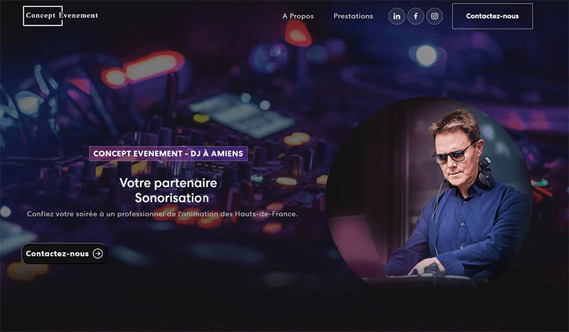

# React Landing OnePage 
## for a local DJ & Event management company 

---
 ## Build with : ##
- Vite.JS
- React Bootstrap
- react-multi-carousel & others...
- [Animate.css](https://animate.style/)
- [EmailJS](https://www.emailjs.com/)
- A lot of ❤️

*One of my first react paid project, still learning everyday.*

The goal of this page is to quickly inform the prospect and push him/her to contact the owner of the website.

The SEO has been specifically designed to position the website on the first page of Google for a local search (meta, alt, file sizes, etc).

Layout structure is equally split between real CSS and bootstrap instructions.
It is fully responsible and loads as fast as possible.

## Test it ##

Test it easily after a git clone via :
*npm install*
*npm run dev*

Will appreciate any feedback 😊
Feel free to contact me on [LinkedIn](https://www.linkedin.com/in/antoine-petit-197914178/)

Thanks for reading. 🖖
Antoine.

